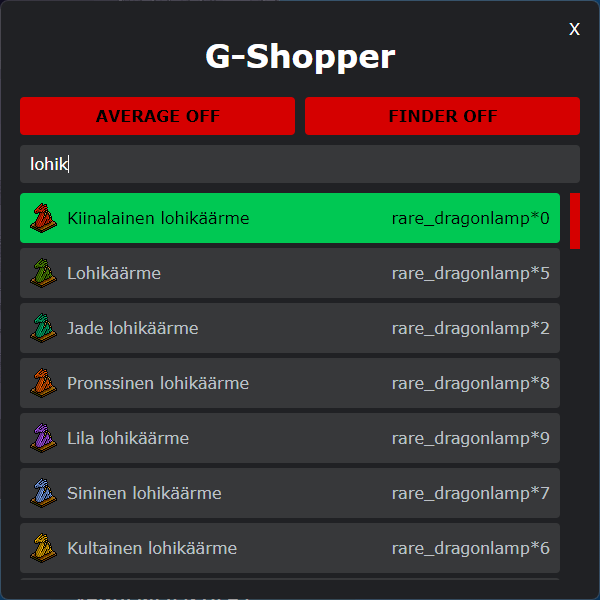

# habbo-average

Node.js [G-Earth](https://github.com/sirjonasxx/G-Earth) extension<br>
G-Node [G-Node](https://github.com/WiredSpast/G-Node)<br>
Requires Node.js V15.0.0+




## How to install

Using npm:

```cmd
$ git clone https://github.com/rocawear-public/habbo-average.git
```

```cmd
$ npm install
```

## How to run extension

```cmd
$ node index.js -p 9092
```

## How to use extension

```
!avg to toggle ON/OFF
Double click furniture on room
```
